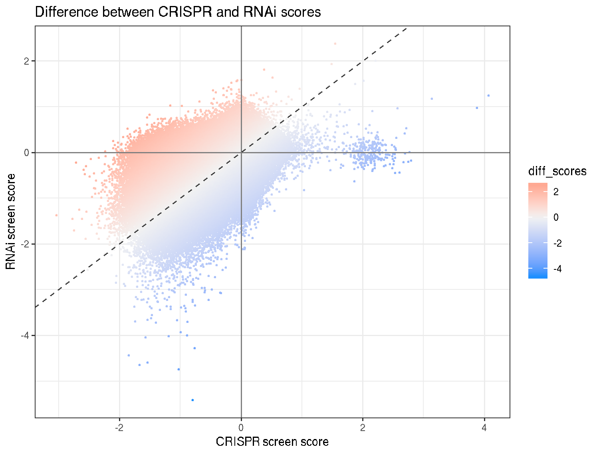
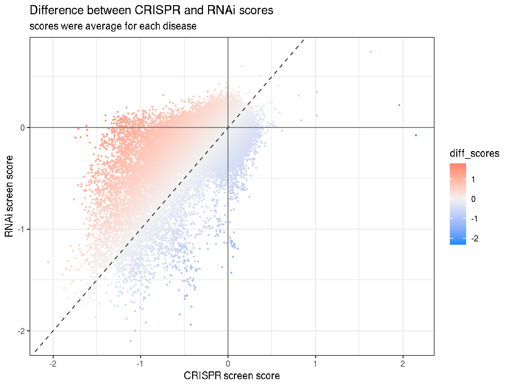

<!-- README.md is generated from README.Rmd. Please edit that file -->

```{r setup, include = FALSE}
library(knitr)
knitr::opts_chunk$set(comment = "#>",
                      collapse = TRUE,
                      echo = TRUE,
                      cache = TRUE)
```

# Tidy Project Achilles Data

**author: Joshua H. Cook**

**last updated: March 15, 2019**

This is "tidy" data from the Broad's [Project Achilles](https://depmap.org/portal/achilles/). The data files are in the "data" directory and exaplined below.

To download this repository, run the following command on the command line.

```bash
git clone https://github.com/jhrcook/tidy_Achilles.git
```

## Data Source

All data was downloaded from the [Broad's DepMap data repository](https://depmap.org/portal/download/all/).\
**web address:** https://depmap.org/portal/download/all/

You can also query genes, cell lines, lineages, etc. from their [website](https://depmap.org/portal/)\
**web address:** https://depmap.org/portal/

The cell line information was obtained from the [Cancer Cell Line Encyclopedia](https://portals.broadinstitute.org/ccle) - their query portal is really useful, too. More data on the cell lines can be downloaded from their website. If you have an requests for data to add to this repo, please open a GitHub [issue](https://github.com/jhrcook/tidy_Achilles/issues).\
**web address:** https://portals.broadinstitute.org/ccle

---

## Raw Data


### DepMap-2019q1-celllines_v2.csv

Information on cell lines from the Broad's [Cancer Cell Line Encyclopedia (CCLE)](https://portals.broadinstitute.org/ccle). The tidy data is available in "cell\_line\_metadata.tib".


### depmap\_19Q1\_mutation\_calls.csv

Mutation data on the cell lines from the Broad's [Cancer Cell Line Encyclopedia (CCLE)](https://portals.broadinstitute.org/ccle). The tidy data is available in "cell\_line\_mutations.tib".

To access the file, decompress it with a GUI tool (usually double-click on Mac works) or use the command line.

```bash
gunzip data/depmap_19Q1_mutation_calls.csv.gz
```


### D2\_combined\_gene\_dep\_scores.csv

The "dependency scores" calculated by the Broad's [Achilles Project](https://depmap.org/portal/achilles/), Novartis' project DRIVE, and the Marcotte *et al.* breast cell line dataset. This file is organized by target name in the first column and the following columns are the scores for each cell line. The tidy data is available in "synthetic_lethal.tib".

These experiments use RNAi to knock-down the expression of the target genes.

To access the file, decompress it with a GUI tool (usually double-click on Mac works) or use the command line.

```bash
gunzip data/D2_combined_gene_dep_scores.csv.gz
```


### nonessential\_genes.txt and essential\_genes.txt

Just a list of genes the DepMap project has declared as essential or nonessential in all cell lines. The tidy data is available in "gene_essentiality.tib".


### public\_19Q1\_gene\_cn.csv

A cell line x gene matrix of copy number calls (they use GATK). The data was broken down by cell line - see below for how to easily load the desired data.


### gene\_effect\_corrected.csv

Thie is a cell line x gene matrix of CERES data normalized to positive controls. The "correction" was to remove batch effects. The tidy data is available in "gene\_effect.tib".

```bash
gunzip data/gene_effect_corrected.csv.gz
```


### gene\_dependency\_corrected.csv

This is a cell line x gene matrix of the probability that knocking out the gene has a real depletion effect. The "correction" was to remove batch effects.

```bash
gunzip data/gene_dependency_corrected.csv.gz
```


### guide\_gene\_map.csv

The mapping of each small guide RNA (sgRNA) to its target gene. The tidy data is available in "guide\_gene\_map.tib".


### To be added

Any others? Open an [issue](https://github.com/jhrcook/tidy_Achilles/issues) for any requested data to include.

---

## Tidy Data Tables

```{r load_libs, message = FALSE, warching = FALSE}
library(tidyverse)
```

All processing was done in "data_preparation.R". The tidy data were stored as "tibbles" (`tbl_df`, instead of R's standard data.frame object) in RDS files. They can all be read directly into R.

```{r example_readRDS, eval = FALSE}
library(tibble)
readRDS("data/example_data_table.tib")
```

More information in the "tidy data" format can be found in [*R for Data Science - Tidy data*](https://r4ds.had.co.nz/tidy-data.html). 


### cell\_line\_metadata.tib

The information for each cell line from the Broad's [Cancer Cell Line Encyclopedia (CCLE)](https://portals.broadinstitute.org/ccle).

```{r show_celllinemeta}
cell_line_metadata <- readRDS(file.path("data", "cell_line_metadata.tib"))
cell_line_metadata
```

**DepMap\_ID** - ID for Dependency Map project\
**CCLE\_Name** - name from the [Cancer Cell Line Encyclopedia (CCLE)](https://portals.broadinstitute.org/ccle)\
**Aliases** - other names\
**COSMIC\_ID** - [COSMIC](https://cancer.sanger.ac.uk/cosmic) ID\
**Sanger\_ID** - Sanger ID\
**Primary\_Disease** - general disease of the cell line\
**Subtype\_Disease** - more specific disease of the cell line\
**Gender** - sex (if known) of the patient\
**Source** - source of the cell line


### cell\_line\_mutations.tib

The mutation data for all cell lines in the Broad's [Cancer Cell Line Encyclopedia (CCLE)](https://portals.broadinstitute.org/ccle).

```{r show_cellline_mutations.tib}
cell_line_mutations <- readRDS(file.path("data", "cell_line_mutations.tib"))
cell_line_mutations
```

**Chromosome** - chromosome of the mutation\
**Start\_position** - start position of the mutation\
**End\_position** - end position of the mutation\
**Strand** - which strand the gene is on (transcribed from)\
**Variant\_Classification** - the consequence of the mutation\
**Variant\_Type** - shorthand consequence of the mutation (DEL, DNP, INS, ONP, SNP, or TN)\
**Reference\_Allele** - nucleotide(s) in the reference\
**Tumor\_Seq\_Allele1** - nucleotide(s) in the sample\
**dbSNP\_RS**, **dbSNP\_Val\_Status** - the ID association in the dbSNP (if available)\
**Genome\_Change** - change to the genome\
**Annotation\_Transcript** - transcript modified by the mutation\
**Tumor\_Sample\_Barcode** - name of the sample (cell line)\
**cDNA\_Change** - change to the cDNA\
**Codon\_Change** - the reference and mutated codon\
**Protein\_Change** - amino acid change\
**isDeleterious**, **Variant\_annotation**, **isTCGAhotspot**, **TCGAhsCnt**, **isCOSMIChotspot**, **COSMIChsCnt** - functional annotation\
**ExAC\_AF**, **VA\_WES\_AC**, **CGA\_WES\_AC**, **SangerWES\_AC**, **SangerRecalibWES\_AC**, **RNAseq\_AC**, **HC\_AC**, **RD\_AC**, **WGS\_AC** -  various accession IDs


### rnai\_synthetic\_lethal (directory)

I had to split up the RNAi synthetic lethal data by tissue so that each data file was small enough to push to GitHub. These are stored in "data/rnai\_synthetic\_lethal/". All or a selection of them can be loaded using `load_rnai_synthetic_lethal`, shown below. It returns a single tibble of the desired tissues' data. The column `score` holds the lethality score that DepMap calculated.

```{r load_snytheticlethal}
# general function for loadng tissue data from a directory
load_tissue_data <- function(dir, tissues = "all") {
    tissues <- paste0(tissues, collapse = "|")
    tidy_path <- file.path("data", dir)
    tidy_files <- list.files(tidy_path, full.name = TRUE)
    if (tissues != "all") {
        tidy_files <-  stringr::str_subset(tidy_files, tissues)
    }
    tidy_tib <- purrr::map(tidy_files, readRDS) %>% bind_rows()
    return(tidy_tib)
}
# specifically for RNAi synthetic lethality
load_rnai_synthetic_lethal <- function(tissues) {
    load_tissue_data(dir = "rnai_synthetic_lethal", tissues = tissues)
}
```

A specific selection of tissues can be loaded by passing a vector of the tissue names (from the file names). Alternatively, all tissues can be gathered by not passing anything.

```{r example_fewtissues}
load_rnai_synthetic_lethal(c("CERVIX", "BONE"))
```


### gene\_effect.tib

 This data is from the CRISPR-based screens. It is stored as a tibble of the CERES- and batch-adjusted essentiality scores for each gene targeted in each cell line. CERES adjusts the depletion score for the copy number of the gene [[PMID: 29083409](https://www.nature.com/articles/ng.3984)].

```{r show_geneeffect}
readRDS(file.path("data", "gene_effect.tib"))
```


### gene\_dependency.tib

This data is from the CRISPR-based screens. It is stored as a tibble with scores for the probability that knocking out the gene has a real depletion effect (corrected for batch effects).

```{r show_genedepend}
readRDS(file.path("data", "gene_dependency.tib"))
```


### gene\_essentiality.tib

A two column tibble of what the DepMap project deems essential or not essential in all cell lines.

```{r sow_essential}
readRDS(file.path("data", "gene_essentiality.tib"))
```


### copy\_number (directory)

The full tibble was too large to push to GitHub (and probably to warrant loading every time), so I separated it by primary disease and stored each as a tibble in "data/copy_number". Again, I supply a function below to retrieve each one or all (default) tissues.

```{r load_celllinecopynum}
load_copy_number <- function(tissues = "all") {
    load_tissue_data(dir = "copy_number", tissues = tissues)
}
```

Here is an example.

```{r show_celllinecopynum}
load_copy_number(c("CERVIX", "BONE"))
```


### guide\_gene\_map.tib

The mapping of each small guide RNA (sgRNA) to its target gene.

```{r show_guidegenemap}
readRDS(file.path("data", "guide_gene_map.tib"))
```


---

## Comparing RNAi vs. CRISPR screens

Below is a plot of all the data points where both RNAi and CRISPR screen scores are available for a cell line and gene.



Below is a plot of all the data points where both RNAi and CRISPR screen scores are available for a disease and gene, with each score being average across the cell lines.



---

If there are any mistake or places for explanation, please open an [issue](https://github.com/jhrcook/tidy_Achilles/issues) or create a pull request if you want to address it yourself.
