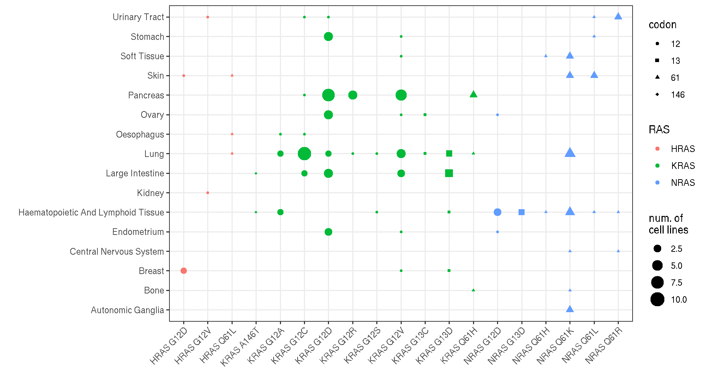
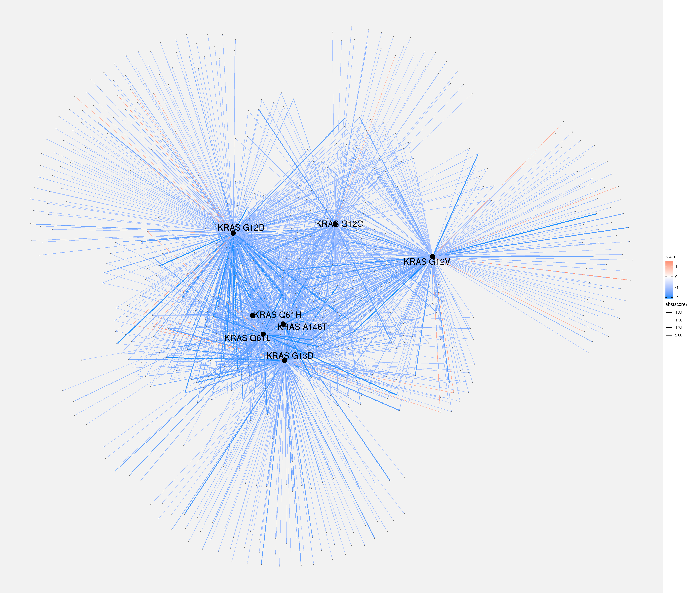
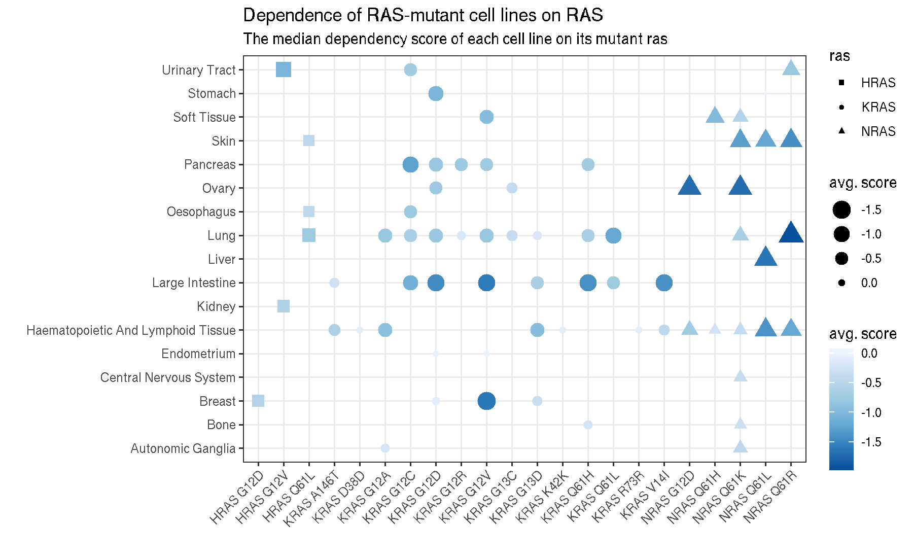

<!-- README.md is generated from README.Rmd. Please edit that file -->

# Tidy Project Achilles Data

**author: Joshua H. Cook**

**last updated: March 15, 2019**

This is “tidy” data from the Broad’s [Project
Achilles](https://depmap.org/portal/achilles/) with a focus of the
various *RAS* alleles. The data files are in the “data” directory and
exaplined below.

``` r
library(tidyverse)
```

To download this repository, run the following command on the command
line.

``` bash
git clone https://github.com/jhrcook/tidy_Achilles.git
```

## Data Source

All data was downloaded from the [Broad’s DepMap data
repository](https://depmap.org/portal/download/all/).  
<https://depmap.org/portal/download/all/>

You can also query genes, cell lines, lineages, etc. from their
[website](https://depmap.org/portal/)  
<https://depmap.org/portal/>

The cell line information was obtained from the [Cancer Cell Line
Encyclopedia](https://portals.broadinstitute.org/ccle) - their query
portal is really useful, too. More data on the cell lines can be
downloaded from their website. If you have an requests for data to add
to this repo, please open a GitHub
[issue](https://github.com/jhrcook/tidy_Achilles/issues).  
<https://portals.broadinstitute.org/ccle>

-----

## Raw Data

### DepMap-2019q1-celllines\_v2.csv

Information on cell lines from the Broad’s [Cancer Cell Line
Encyclopedia (CCLE)](https://portals.broadinstitute.org/ccle). The tidy
data is available in “cell\_line\_metadata.tib”.

### depmap\_19Q1\_mutation\_calls.csv

Mutation data on the cell lines from the Broad’s [Cancer Cell Line
Encyclopedia (CCLE)](https://portals.broadinstitute.org/ccle). The tidy
data is available in “cell\_line\_mutations.tib”.

To access the file, decompress it with a GUI tool (usually double-click
on Mac works) or use the command line.

``` bash
gunzip data/depmap_19Q1_mutation_calls.csv.gz
```

### D2\_combined\_gene\_dep\_scores.csv

The “dependency scores” calculated by the [Achilles Project RNAi
screen](https://depmap.org/portal/achilles/). This file is organized by
target name in the first column and the following columns are the scores
for each cell line. The tidy data is available in
“synthetic\_lethal.tib”.

To access the file, decompress it with a GUI tool (usually double-click
on Mac works) or use the command line.

``` bash
gunzip data/D2_combined_gene_dep_scores.csv.gz
```

### nonessential\_genes.txt and essential\_genes.txt

Just a list of genes the DepMap project has declared as essential or
nonessential in all cell lines. The tidy data is available in
“gene\_essentiality.tib”.

### public\_19Q1\_gene\_cn.csv

A cell line x gene matrix of copy number calls (they use GATK). The data
was broken down by cell line - see below for how to easily load the
desired data.

### gene\_effect\_corrected.csv

**TODO**

``` bash
gunzip data/gene_effect_corrected.csv.gz
```

### gene\_dependency\_corrected.csv

**TODO**

``` bash
gunzip data/gene_dependency_corrected.csv.gz
```

### To be added

Any others? Open an
[issue](https://github.com/jhrcook/tidy_Achilles/issues) for any
requested data to include.

-----

## Tidy Data Tables

All processing was done in “data\_preparation.R”. The tidy data were
stored as “tibbles” (`tbl_df`, instead of R’s standard data.frame
object) in RDS files. They can all be read directly into R.

``` r
library(tibble)
readRDS("data/example_data_table.tib")
```

More information in the “tidy data” format can be found in [*R for Data
Science - Tidy data*](https://r4ds.had.co.nz/tidy-data.html).

### cell\_line\_metadata.tib

The information for each cell line from the Broad’s [Cancer Cell Line
Encyclopedia
(CCLE)](https://portals.broadinstitute.org/ccle).

``` r
cell_line_metadata <- readRDS(file.path("data", "cell_line_metadata.tib"))
cell_line_metadata
#> # A tibble: 1,676 x 9
#>    DepMap_ID CCLE_Name Aliases COSMIC_ID Sanger_ID Primary_Disease
#>    <chr>     <chr>     <chr>       <dbl>     <dbl> <chr>          
#>  1 ACH-0000… NIHOVCAR… NIH:OV…    905933      2201 Ovarian Cancer 
#>  2 ACH-0000… HL60_HAE… HL-60      905938        55 Leukemia       
#>  3 ACH-0000… CACO2_LA… CACO2;…        NA        NA Colon/Colorect…
#>  4 ACH-0000… HEL_HAEM… HEL        907053       783 Leukemia       
#>  5 ACH-0000… HEL9217_… HEL 92…        NA        NA Leukemia       
#>  6 ACH-0000… MONOMAC6… MONO-M…    908148      2167 Leukemia       
#>  7 ACH-0000… LS513_LA… LS513      907795       569 Colon/Colorect…
#>  8 ACH-0000… C2BBE1_L… C2BBe1     910700      2104 Colon/Colorect…
#>  9 ACH-0000… NCIH2077… NCI-H2…        NA        NA Lung Cancer    
#> 10 ACH-0000… 253J_URI… 253J           NA        NA Bladder Cancer 
#> # … with 1,666 more rows, and 3 more variables: Subtype_Disease <chr>,
#> #   Gender <chr>, Source <chr>
```

**DepMap\_ID** - ID for Dependency Map project  
**CCLE\_Name** - name from the [Cancer Cell Line Encyclopedia
(CCLE)](https://portals.broadinstitute.org/ccle)  
**Aliases** - other names  
**COSMIC\_ID** - [COSMIC](https://cancer.sanger.ac.uk/cosmic) ID  
**Sanger\_ID** - Sanger ID  
**Primary\_Disease** - general disease of the cell line  
**Subtype\_Disease** - more specific disease of the cell line  
**Gender** - sex (if known) of the patient  
**Source** - source of the cell line

### cell\_line\_mutations.tib

The mutation data for all cell lines in the Broad’s [Cancer Cell Line
Encyclopedia
(CCLE)](https://portals.broadinstitute.org/ccle).

``` r
cell_line_mutations <- readRDS(file.path("data", "cell_line_mutations.tib"))
cell_line_mutations
#> # A tibble: 1,243,145 x 35
#>    Hugo_Symbol Entrez_Gene_Id NCBI_Build Chromosome Start_position
#>    <chr>                <dbl>      <dbl> <chr>               <dbl>
#>  1 VPS13D               55187         37 1                12359347
#>  2 AADACL4             343066         37 1                12726308
#>  3 IFNLR1              163702         37 1                24484172
#>  4 TMEM57               55219         37 1                25785018
#>  5 ZSCAN20               7579         37 1                33954141
#>  6 POU3F1                5453         37 1                38512139
#>  7 MAST2                23139         37 1                46498028
#>  8 GBP4                115361         37 1                89657103
#>  9 VAV3                 10451         37 1               108247170
#> 10 NBPF20           100288142         37 1               148346689
#> # … with 1,243,135 more rows, and 30 more variables: End_position <dbl>,
#> #   Strand <chr>, Variant_Classification <chr>, Variant_Type <chr>,
#> #   Reference_Allele <chr>, Tumor_Seq_Allele1 <chr>, dbSNP_RS <chr>,
#> #   dbSNP_Val_Status <chr>, Genome_Change <chr>,
#> #   Annotation_Transcript <chr>, Tumor_Sample_Barcode <chr>,
#> #   cDNA_Change <chr>, Codon_Change <chr>, Protein_Change <chr>,
#> #   isDeleterious <lgl>, isTCGAhotspot <lgl>, TCGAhsCnt <dbl>,
#> #   isCOSMIChotspot <lgl>, COSMIChsCnt <dbl>, ExAC_AF <dbl>,
#> #   VA_WES_AC <chr>, CGA_WES_AC <chr>, SangerWES_AC <chr>,
#> #   SangerRecalibWES_AC <chr>, RNAseq_AC <chr>, HC_AC <chr>, RD_AC <chr>,
#> #   WGS_AC <chr>, Variant_annotation <chr>, DepMap_ID <chr>
```

**Chromosome** - chromosome of the mutation  
**Start\_position** - start position of the mutation  
**End\_position** - end position of the mutation  
**Strand** - which strand the gene is on (transcribed from)  
**Variant\_Classification** - the consequence of the mutation  
**Variant\_Type** - shorthand consequence of the mutation (DEL, DNP,
INS, ONP, SNP, or TN)  
**Reference\_Allele** - nucleotide(s) in the reference  
**Tumor\_Seq\_Allele1** - nucleotide(s) in the sample  
**dbSNP\_RS**, **dbSNP\_Val\_Status** - the ID association in the dbSNP
(if available)  
**Genome\_Change** - change to the genome  
**Annotation\_Transcript** - transcript modified by the mutation  
**Tumor\_Sample\_Barcode** - name of the sample (cell line)  
**cDNA\_Change** - change to the cDNA  
**Codon\_Change** - the reference and mutated codon  
**Protein\_Change** - amino acid change  
**isDeleterious**, **Variant\_annotation**, **isTCGAhotspot**,
**TCGAhsCnt**, **isCOSMIChotspot**, **COSMIChsCnt** - functional
annotation  
**ExAC\_AF**, **VA\_WES\_AC**, **CGA\_WES\_AC**, **SangerWES\_AC**,
**SangerRecalibWES\_AC**, **RNAseq\_AC**, **HC\_AC**, **RD\_AC**,
**WGS\_AC** - various accession IDs

### cell\_line\_ras\_anno.tib

The cell line information with the status of the *RAS* isoforms. If they
are all wild-type, then the `ras` and `allele` columns will both be
`"WT"`. If a cell line has multiple RAS mutations, each one is a
separate
row.

``` r
cell_line_ras_anno <- readRDS(file.path("data", "cell_line_ras_anno.tib"))
cell_line_ras_anno
#> # A tibble: 1,745 x 12
#>    DepMap_ID CCLE_Name Aliases COSMIC_ID Sanger_ID Primary_Disease
#>    <chr>     <chr>     <chr>       <dbl>     <dbl> <chr>          
#>  1 ACH-0000… NIHOVCAR… NIH:OV…    905933      2201 Ovarian Cancer 
#>  2 ACH-0000… HL60_HAE… HL-60      905938        55 Leukemia       
#>  3 ACH-0000… CACO2_LA… CACO2;…        NA        NA Colon/Colorect…
#>  4 ACH-0000… HEL_HAEM… HEL        907053       783 Leukemia       
#>  5 ACH-0000… HEL9217_… HEL 92…        NA        NA Leukemia       
#>  6 ACH-0000… MONOMAC6… MONO-M…    908148      2167 Leukemia       
#>  7 ACH-0000… LS513_LA… LS513      907795       569 Colon/Colorect…
#>  8 ACH-0000… C2BBE1_L… C2BBe1     910700      2104 Colon/Colorect…
#>  9 ACH-0000… NCIH2077… NCI-H2…        NA        NA Lung Cancer    
#> 10 ACH-0000… 253J_URI… 253J           NA        NA Bladder Cancer 
#> # … with 1,735 more rows, and 6 more variables: Subtype_Disease <chr>,
#> #   Gender <chr>, Source <chr>, ras <chr>, allele <chr>, ras_allele <chr>
```

### ras\_muts\_annotated.tib

The *RAS* mutant cell lines. This if the same data as in
“cell\_line\_ras\_anno.tib”, but only *RAS* mutants. The columns are
in a different order, but hold the same
data.

``` r
ras_muts_annotated <- readRDS(file.path("data", "ras_muts_annotated.tib"))
ras_muts_annotated
#> # A tibble: 420 x 12
#>    DepMap_ID ras   allele ras_allele CCLE_Name Aliases COSMIC_ID Sanger_ID
#>    <chr>     <chr> <chr>  <chr>      <chr>     <chr>       <dbl>     <dbl>
#>  1 ACH-0000… NRAS  Q61L   NRAS_Q61L  HL60_HAE… HL-60      905938        55
#>  2 ACH-0000… KRAS  G12D   KRAS_G12D  LS513_LA… LS513      907795       569
#>  3 ACH-0000… HRAS  G12V   HRAS_G12V  T24_URIN… T24        724812      1455
#>  4 ACH-0000… KRAS  G12V   KRAS_G12V  PATU8988… PA-TU-…        NA        NA
#>  5 ACH-0000… KRAS  G12V   KRAS_G12V  PATU8988… PA-TU-…   1240201      1242
#>  6 ACH-0000… NRAS  Q61K   NRAS_Q61K  CH157MN_… CH-157…        NA        NA
#>  7 ACH-0000… KRAS  Q61R   KRAS_Q61R  PANC0213… Panc 0…        NA        NA
#>  8 ACH-0000… NRAS  Q61L   NRAS_Q61L  PLB985_H… PLB985…        NA        NA
#>  9 ACH-0000… KRAS  G12D   KRAS_G12D  PANC0203… Panc 0…   1298475      1838
#> 10 ACH-0000… NRAS  G13D   NRAS_G13D  NCIH929_… NCI-H9…    724825      1230
#> # … with 410 more rows, and 4 more variables: Primary_Disease <chr>,
#> #   Subtype_Disease <chr>, Gender <chr>, Source <chr>
```

Here is a chart to breakdown the number of cell lines for each *RAS*
alleles across the tissues.



### synthetic\_lethal/

I had to split up the synthetic lethal data by tissue so that each data
file was small enough to push to GitHub. These are stored in
“data/synthetic\_lethal/”. All or a selection of them can be loaded
using `load\_synthetic\_lethal`. It returns a single tibble of the
desired data. The only new column here is `score` which holds the
lethality score that DepMap calculated.

``` r
load_synthetic_lethal <- function(tissues = "all") {
    tissues <- paste0(tissues, collapse = "|")
    synlet_path <- file.path("data", "synthetic_lethal")
    synlet_files <- list.files(synlet_path, full.name = TRUE,
                               pattern = "_syn_lethal.tib")
    if (tissues != "all") {
        synlet_files <-  stringr::str_subset(synlet_files, tissues)
    }
    synlet <- purrr::map(synlet_files, readRDS) %>% bind_rows()
    return(synlet)
}
```

A specific selection of tissues can be loaded by passing a vector of the
tissue names (from the file names).

``` r
cervix_synlet <- load_synthetic_lethal(c("CERVIX", "BONE"))
cervix_synlet
#> # A tibble: 328,871 x 15
#>    gene  cell_line    score DepMap_ID Aliases COSMIC_ID Sanger_ID
#>    <chr> <chr>        <dbl> <chr>     <chr>       <dbl>     <dbl>
#>  1 A1BG  143B_BONE  0.146   ACH-0010… <NA>           NA        NA
#>  2 NAT2  143B_BONE  0.103   ACH-0010… <NA>           NA        NA
#>  3 ADA   143B_BONE  0.169   ACH-0010… <NA>           NA        NA
#>  4 CDH2  143B_BONE  0.0630  ACH-0010… <NA>           NA        NA
#>  5 AKT3  143B_BONE -0.00808 ACH-0010… <NA>           NA        NA
#>  6 MED6  143B_BONE -0.214   ACH-0010… <NA>           NA        NA
#>  7 NR2E3 143B_BONE -0.154   ACH-0010… <NA>           NA        NA
#>  8 NAAL… 143B_BONE  0.134   ACH-0010… <NA>           NA        NA
#>  9 DUXB  143B_BONE  0.139   ACH-0010… <NA>           NA        NA
#> 10 PDZK… 143B_BONE  0.0303  ACH-0010… <NA>           NA        NA
#> # … with 328,861 more rows, and 8 more variables: Primary_Disease <chr>,
#> #   Subtype_Disease <chr>, Gender <chr>, Source <chr>, ras <chr>,
#> #   allele <chr>, ras_allele <chr>, tissue <chr>
```

Or all tissues can be gathered by not passing anything.

``` r
synthetic_lethal <- load_synthetic_lethal()
synthetic_lethal
#> # A tibble: 12,808,660 x 15
#>    gene  cell_line    score DepMap_ID Aliases COSMIC_ID Sanger_ID
#>    <chr> <chr>        <dbl> <chr>     <chr>       <dbl>     <dbl>
#>  1 A1BG  KELLY_AU…  NA      ACH-0002… KELLY      753618       225
#>  2 NAT2  KELLY_AU…  NA      ACH-0002… KELLY      753618       225
#>  3 ADA   KELLY_AU…  NA      ACH-0002… KELLY      753618       225
#>  4 CDH2  KELLY_AU…   0.133  ACH-0002… KELLY      753618       225
#>  5 AKT3  KELLY_AU…   0.142  ACH-0002… KELLY      753618       225
#>  6 MED6  KELLY_AU…  -0.410  ACH-0002… KELLY      753618       225
#>  7 NR2E3 KELLY_AU…  -0.0657 ACH-0002… KELLY      753618       225
#>  8 NAAL… KELLY_AU…  NA      ACH-0002… KELLY      753618       225
#>  9 DUXB  KELLY_AU…  NA      ACH-0002… KELLY      753618       225
#> 10 PDZK… KELLY_AU…  NA      ACH-0002… KELLY      753618       225
#> # … with 12,808,650 more rows, and 8 more variables:
#> #   Primary_Disease <chr>, Subtype_Disease <chr>, Gender <chr>,
#> #   Source <chr>, ras <chr>, allele <chr>, ras_allele <chr>, tissue <chr>
```

### gene\_essentiality.tib

A two column tibble of what the DepMap project deems essential or not
essential in all cell lines.

``` r
readRDS(file.path("data", "gene_essentiality.tib"))
#> # A tibble: 993 x 2
#>    gene   is_essential
#>    <chr>  <lgl>       
#>  1 RPS11  TRUE        
#>  2 RPS17  TRUE        
#>  3 RPL4   TRUE        
#>  4 EIF3D  TRUE        
#>  5 RPL27  TRUE        
#>  6 RPL10A TRUE        
#>  7 RPS13  TRUE        
#>  8 U2AF1  TRUE        
#>  9 POLR2D TRUE        
#> 10 RPS15A TRUE        
#> # … with 983 more rows
```

### copy\_number/

The full tibble was too large to push to GitHub (and probably to warrant
loading every single time), so I separated it by cell line and stored
each as a tibble in “data/copy\_number”. Again, I supply a function
below to retrieve each one.

``` r
load_copy_number <- function(cell_line = "all") {
    cell_line <- paste0(cell_line, collapse = "|")
    copynum_path <- file.path("data", "copy_number")
    copynum_files <- list.files(copynum_path, full.name = TRUE,
                               pattern = "_syn_lethal.tib")
    if (cell_line != "all") {
        copynum_files <-  stringr::str_subset(copynum_files, cell_line)
    }
    copynum <- purrr::map(copynum_files, readRDS) %>% bind_rows()
    return(copynum)
}
```

Here is an example.

``` r
load_copy_number("ACH-000690")
#> # A tibble: 23,299 x 3
#>    gene       copy_number cell_line 
#>    <chr>            <dbl> <chr>     
#>  1 A1BG             0.19  ACH-000690
#>  2 NAT2            -1.32  ACH-000690
#>  3 ADA              0.295 ACH-000690
#>  4 CDH2            -3.99  ACH-000690
#>  5 AKT3             0.292 ACH-000690
#>  6 GAGE12F         -0.246 ACH-000690
#>  7 ZBTB11-AS1       0.112 ACH-000690
#>  8 MED6             0.226 ACH-000690
#>  9 NR2E3           -0.128 ACH-000690
#> 10 NAALAD2          0.007 ACH-000690
#> # … with 23,289 more rows
```

*I will add other cell line information in the future.*

-----

## Graphs

### ras\_dependency\_graph.gr

A graph was created for the dependency score in each *RAS*-mutant cell
line. Each edge represents a score between a *RAS* allele and gene
(including the *RAS* isoforms).

``` r
library(tidygraph)
ras_dependency_graph <- readRDS(file.path("data", "ras_dependency_graph.gr"))
ras_dependency_graph
#> # A tbl_graph: 17325 nodes and 1938496 edges
#> #
#> # An undirected multigraph with 1 component
#> #
#> # Node Data: 17,325 x 2 (active)
#>   name       gene_group
#>   <chr>      <chr>     
#> 1 KRAS_G12D  ras       
#> 2 KRAS_A146T ras       
#> 3 KRAS_G12C  ras       
#> 4 KRAS_G12V  ras       
#> 5 HRAS_Q61L  ras       
#> 6 KRAS_Q61H  ras       
#> # … with 1.732e+04 more rows
#> #
#> # Edge Data: 1,938,496 x 10
#>    from    to cell_line tissue  score ras   allele codon Primary_Disease
#>   <int> <int> <chr>     <chr>   <dbl> <chr> <chr>  <chr> <chr>          
#> 1     1    17 A427_LUNG LUNG   0.0837 KRAS  G12D   12    Lung Cancer    
#> 2     1    18 A427_LUNG LUNG   0.0458 KRAS  G12D   12    Lung Cancer    
#> 3     1    19 A427_LUNG LUNG   0.101  KRAS  G12D   12    Lung Cancer    
#> # … with 1.938e+06 more rows, and 1 more variable: Subtype_Disease <chr>
```

Here is an example of the colorectal cancer cell lines with *KRAS*
mutations in the hotspot codons, only showing edges for scores greater
than 1 (red) or less than -1 (blue). If there were multiple scores for a
target-*RAS* allele, the median value was used.



Below are the dependency values each *RAS* allele on the corresponding
*RAS* gene.



-----

If there are any mistake or places for explanation, please open an
[issue](https://github.com/jhrcook/tidy_Achilles/issues) or create a
pull request if you want to address it yourself.
