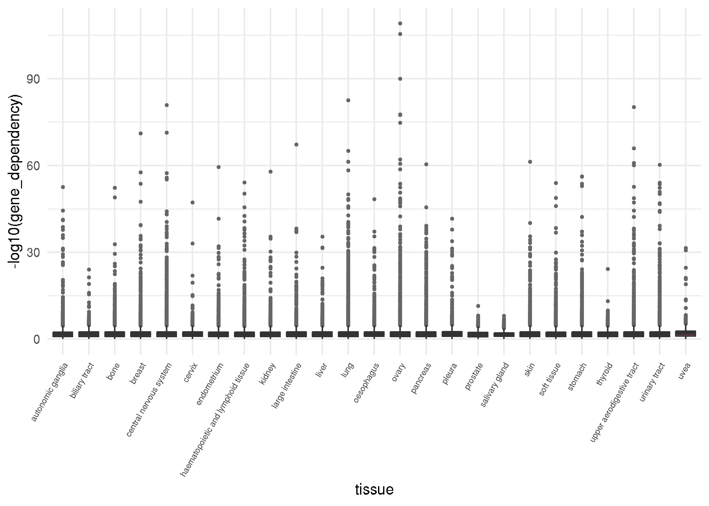

<!-- README.md is generated from README.Rmd. Please edit that file -->

# Tidy Project Achilles Data (tidy\_Achilles)

**author: Joshua H. Cook**  
**last updated: June 12, 2019**

**[GitHub repository](https://github.com/jhrcook/tidy_Achilles)**

This is “tidy” data from the Broad’s [Project
Achilles](https://depmap.org/portal/achilles/). The data files are in
the “data” directory and exaplined below.

To download this repository, run the following command on the command
line.

``` bash
git clone https://github.com/jhrcook/tidy_Achilles.git
```

## Data Source

All data was downloaded from the [Broad’s DepMap data
repository](https://depmap.org/portal/download/all/).  
**web address:** <https://depmap.org/portal/download/all/>

You can also query genes, cell lines, lineages, etc. from their
[website](https://depmap.org/portal/)  
**web address:** <https://depmap.org/portal/>

The cell line information was obtained from the [Cancer Cell Line
Encyclopedia](https://portals.broadinstitute.org/ccle) - their query
portal is really useful, too. More data on the cell lines can be
downloaded from their website. If you have an requests for data to add
to this repo, please open a GitHub
[issue](https://github.com/jhrcook/tidy_Achilles/issues).  
**web address:** <https://portals.broadinstitute.org/ccle>

-----

## Raw Data

### Cell Line Data

The following files contain information about the cell lines in the
CCLE. Some, but not all, have been screen by the DepMap Project.

  - sample\_info.csv - information on the cell lines
  - CCLE\_mutations.csv.tar.gz - mutations of the cell lines
  - CCLE\_expression.csv.tar.gz - gene expression of the cell lines (in
    TPM)
  - CCLE\_gene\_cn.csv.tar.gz - copy number of each gene in the cell
    lines

### Achilles Genetic Dependencies

The Achilles project used RNAi to deplete each gene in the cell lines,
but has since transitioned to a CRISPR loss-of-function screen. That
data is available in this repository. The following files hold
information on the effect of knocking-out each gene on the survival of
the cell line.

  - Achilles\_gene\_dependency.csv.tar.gz - probability that knocking
    out the gene has a real depletion effect
  - Achilles\_gene\_effect.csv.tar.gz - CERES data with principle
    components strongly related to known batch effects removed, then
    shifted and scaled per cell line so the median nonessential KO
    effect is 0 and the median essential KO effect is -1

### Achilles Guides

The Achilles project used RNAi to deplete each gene in the cell lines,
but has since transitioned to a CRISPR loss-of-function screen. That
data is available in this repository. The following files hold
information on the guides used in the CRISPR screen.

  - Achilles\_guide\_efficacy.csv - CERES inferred efficacy for the
    guide
  - Achilles\_guide\_map.csv - where the guide targets on the genome
    (including gene name)
  - Achilles\_dropped\_guides.csv - guides that were dropped, usually
    for likely off-target effects

### Achilles misc.

  - Achilles\_replicate\_map.csv - indicates which processing batch the
    replicate belongs to and therefore which pDNA reference it should be
    compared with

### Essential Genes

The data collected from the Achilles project was used to determine which
genes were broadly essential.

  - common\_essentials.csv - genes used as positive controls,
    intersection of Biomen (2014) and Hart (2015) essentials; the scores
    of these genes are used as the dependent distribution for inferring
    dependency probability
  - Achilles\_common\_essentials.csv - genes identified as dependencies
    in all lines
  - nonessentials.csv - genes used as negative controls (Hart (2014)
    nonessentials)

### To be added

Any others? Open an
[issue](https://github.com/jhrcook/tidy_Achilles/issues) for any
requested data to include.

-----

## Tidy Data

``` r
library(tidyverse)
```

All processing was done in “data\_preparation.R”. The tidy data were
stored as “tibbles” (`tbl_df` instead of R’s standard `data.frame`
object) in RDS files. They can all be read directly into R.

``` r
library(tibble)
readRDS("data/example_data_table.tib")
```

More information in the “tidy data” format can be found in [*R for Data
Science - Tidy data*](https://r4ds.had.co.nz/tidy-data.html).

### Cell Line Data

#### Meta data

The following data frame holds meta data on the cell lines used in the
CRISPR screen (an other cell lines in the CCLE). Use the `dep_map_id`
column for unique identification and matching with the data frames
included in this repository. The columns `disease` and `disease_sutype`
provide information on where the cell line originated.

``` r
readRDS(file.path("data", "cell_line_metadata.tib"))
#> # A tibble: 1,714 x 16
#>    dep_map_id stripped_cell_l… ccle_name alias cosmic_id sanger_id disease
#>    <chr>      <chr>            <chr>     <chr>     <dbl>     <dbl> <chr>  
#>  1 ACH-000001 NIHOVCAR3        NIHOVCAR… OVCA…    905933      2201 ovary  
#>  2 ACH-000002 HL60             HL60_HAE… <NA>     905938        55 leukem…
#>  3 ACH-000003 CACO2            CACO2_LA… CACO…        NA        NA colore…
#>  4 ACH-000004 HEL              HEL_HAEM… <NA>     907053       783 leukem…
#>  5 ACH-000005 HEL9217          HEL9217_… <NA>         NA        NA leukem…
#>  6 ACH-000006 MONOMAC6         MONOMAC6… <NA>     908148      2167 leukem…
#>  7 ACH-000007 LS513            LS513_LA… <NA>     907795       569 colore…
#>  8 ACH-000008 A101D            A101D_SK… <NA>     910921      1806 <NA>   
#>  9 ACH-000009 C2BBE1           C2BBE1_L… <NA>     910700      2104 colore…
#> 10 ACH-000010 NCIH2077         NCIH2077… NCI-…        NA        NA lung   
#> # … with 1,704 more rows, and 9 more variables: disease_sutype <chr>,
#> #   disease_sub_subtype <chr>, gender <chr>, source <chr>,
#> #   achilles_n_replicates <dbl>, cell_line_nnmd <dbl>, culture_type <chr>,
#> #   culture_medium <chr>, cas9_activity <chr>
```

#### Mutations

All of the cell lines in the CCLE have been whole exome sequenced. Their
mutations are contained in the following file. Both the Hugo and Entrez
gene identifiers are available (`hugo_symbol` and `entrez_gene_id`,
respectively). Use the `dep_map_id` column for unique identification and
matching with the data frames included in this repository. The specific
mutations to the proteins are in the `protein_change` column.

``` r
readRDS(file.path("data", "cell_line_mutations.tib"))
#> # A tibble: 1,227,713 x 34
#>    hugo_symbol entrez_gene_id ncbi_build chromosome start_position
#>    <chr>                <dbl>      <dbl> <chr>               <dbl>
#>  1 VPS13D               55187         37 1                12359347
#>  2 AADACL4             343066         37 1                12726308
#>  3 IFNLR1              163702         37 1                24484172
#>  4 TMEM57               55219         37 1                25785018
#>  5 ZSCAN20               7579         37 1                33954141
#>  6 POU3F1                5453         37 1                38512139
#>  7 MAST2                23139         37 1                46498028
#>  8 GBP4                115361         37 1                89657103
#>  9 VAV3                 10451         37 1               108247170
#> 10 NBPF20           100288142         37 1               148346689
#> # … with 1,227,703 more rows, and 29 more variables: end_position <dbl>,
#> #   strand <chr>, variant_classification <chr>, variant_type <chr>,
#> #   reference_allele <chr>, tumor_seq_allele1 <chr>, db_snp_rs <chr>,
#> #   db_snp_val_status <chr>, genome_change <chr>,
#> #   annotation_transcript <chr>, tumor_sample_barcode <chr>,
#> #   c_dna_change <chr>, codon_change <chr>, protein_change <chr>,
#> #   is_deleterious <lgl>, is_tcg_ahotspot <lgl>, tcg_ahs_cnt <dbl>,
#> #   is_cosmi_chotspot <lgl>, cosmi_chs_cnt <dbl>, ex_ac_af <dbl>,
#> #   cga_wes_ac <chr>, sanger_wes_ac <chr>, sanger_recalib_wes_ac <chr>,
#> #   rn_aseq_ac <chr>, hc_ac <chr>, rd_ac <chr>, wgs_ac <chr>,
#> #   variant_annotation <chr>, dep_map_id <chr>
```

#### Copy Number

Due to size restrictions, the gene copy number data was separated into
multiple files by tissue of origin of the cell line. The Hugo gene
identifier is available in the `gene` column. Use the `dep_map_id`
column for unique identification and matching with the data frames
included in this repository. The copy number information is in the
`copy_number` column.

``` r
readRDS(file.path("data", "copy_number", "PANCREAS_copynum.tib"))
#> # A tibble: 1,304,744 x 19
#>    dep_map_id gene  copy_number stripped_cell_l… ccle_name alias cosmic_id
#>    <chr>      <chr>       <dbl> <chr>            <chr>     <chr>     <dbl>
#>  1 ACH-000178 A1BG        0.877 HS766T           HS766T_P… <NA>    1298141
#>  2 ACH-000281 A1BG        0.944 KP2              KP2_PANC… <NA>    1298218
#>  3 ACH-000685 A1BG        1.20  L33              L33_PANC… <NA>         NA
#>  4 ACH-000042 A1BG        1.33  PANC0203         PANC0203… <NA>    1298475
#>  5 ACH-000031 A1BG        0.874 PANC0213         PANC0213… <NA>         NA
#>  6 ACH-000235 A1BG        0.832 PANC0403         PANC0403… <NA>    1298476
#>  7 ACH-000093 A1BG        1.03  PANC0504         PANC0504… <NA>         NA
#>  8 ACH-000599 A1BG        0.791 PATU8902         PATU8902… <NA>    1298526
#>  9 ACH-000307 A1BG        1.07  PK1              PK1_PANC… <NA>         NA
#> 10 ACH-000205 A1BG        1.42  PK59             PK59_PAN… <NA>         NA
#> # … with 1,304,734 more rows, and 12 more variables: sanger_id <dbl>,
#> #   disease <chr>, disease_sutype <chr>, disease_sub_subtype <chr>,
#> #   gender <chr>, source <chr>, achilles_n_replicates <dbl>,
#> #   cell_line_nnmd <dbl>, culture_type <chr>, culture_medium <chr>,
#> #   cas9_activity <chr>, tissue <chr>
```

#### Gene Expression

Due to size restrictions, the gene expression (in TPM) data was
separated into multiple files by tissue of origin of the cell line. The
Hugo gene identifier is available in the `gene` column. Use the
`dep_map_id` column for unique identification and matching with the data
frames included in this repository. The expression values are in the
`gene_expression` column.

``` r
readRDS(file.path("data", "gene_expression", "PANCREAS_geneexpr.tib"))
#> # A tibble: 876,757 x 19
#>    dep_map_id gene  gene_expression stripped_cell_l… ccle_name alias
#>    <chr>      <chr>           <dbl> <chr>            <chr>     <chr>
#>  1 ACH-000222 TSPA…            5.97 ASPC1            ASPC1_PA… <NA> 
#>  2 ACH-000535 TSPA…            5.89 BXPC3            BXPC3_PA… <NA> 
#>  3 ACH-000354 TSPA…            4.53 CAPAN1           CAPAN1_P… <NA> 
#>  4 ACH-000107 TSPA…            5.21 CAPAN2           CAPAN2_P… <NA> 
#>  5 ACH-000138 TSPA…            5.23 CFPAC1           CFPAC1_P… <NA> 
#>  6 ACH-000243 TSPA…            4.79 DANG             DANG_PAN… <NA> 
#>  7 ACH-000270 TSPA…            4.85 HPAC             HPAC_PAN… <NA> 
#>  8 ACH-000094 TSPA…            6.23 HPAFII           HPAFII_P… <NA> 
#>  9 ACH-000178 TSPA…            5.79 HS766T           HS766T_P… <NA> 
#> 10 ACH-000118 TSPA…            4.47 HUPT3            HUPT3_PA… <NA> 
#> # … with 876,747 more rows, and 13 more variables: cosmic_id <dbl>,
#> #   sanger_id <dbl>, disease <chr>, disease_sutype <chr>,
#> #   disease_sub_subtype <chr>, gender <chr>, source <chr>,
#> #   achilles_n_replicates <dbl>, cell_line_nnmd <dbl>, culture_type <chr>,
#> #   culture_medium <chr>, cas9_activity <chr>, tissue <chr>
```

### Achilles

A cell line is dependent on a gene if the deletion of the gene causes a
decrease in vitality of the cell line. The Achilles project is using a
genome-wide CRISPR-Cas9 loss-of-function screen to test hundreds of cell
line’s dependencies.

The `Achilles_gene_dependency.tib` contains the probability that
knocking out the gene has a real depletion effect. The Hugo gene
identifier is available in the `gene` column. Use the `dep_map_id`
column for unique identification and matching with the data frames
included in this repository. The dependency score is in the
`gene_dependency` column. This file includes the CCLE sample
information, too.

``` r
readRDS(file.path("data", "Achilles_gene_dependency.tib"))
#> # A tibble: 9,927,942 x 19
#>    dep_map_id gene  gene_dependency stripped_cell_l… ccle_name alias
#>    <chr>      <chr>           <dbl> <chr>            <chr>     <chr>
#>  1 ACH-000004 A1BG         0.00160  HEL              HEL_HAEM… <NA> 
#>  2 ACH-000007 A1BG         0.00362  LS513            LS513_LA… <NA> 
#>  3 ACH-000009 A1BG         0.00348  C2BBE1           C2BBE1_L… <NA> 
#>  4 ACH-000011 A1BG         0.000310 253J             253J_URI… <NA> 
#>  5 ACH-000012 A1BG         0.00789  HCC827           HCC827_L… <NA> 
#>  6 ACH-000013 A1BG         0.00685  ONCODG1          ONCODG1_… <NA> 
#>  7 ACH-000014 A1BG         0.00101  HS294T           HS294T_S… A101…
#>  8 ACH-000015 A1BG         0.0216   NCIH1581         NCIH1581… NCI-…
#>  9 ACH-000017 A1BG         0.00112  SKBR3            SKBR3_BR… <NA> 
#> 10 ACH-000018 A1BG         0.00977  T24              T24_URIN… <NA> 
#> # … with 9,927,932 more rows, and 13 more variables: cosmic_id <dbl>,
#> #   sanger_id <dbl>, disease <chr>, disease_sutype <chr>,
#> #   disease_sub_subtype <chr>, gender <chr>, source <chr>,
#> #   achilles_n_replicates <dbl>, cell_line_nnmd <dbl>, culture_type <chr>,
#> #   culture_medium <chr>, cas9_activity <chr>, tissue <chr>
```

<!-- -->

The depletion effect of targeting each gene is in
`Achilles_gene_effect.tib`. This contains CERES data with principle
components strongly related to known batch effects removed, then shifted
and scaled per cell line so the median nonessential knock-out effect is
0 and the median essential knock-out effect is -1. The gene effect
values are in the `gene_effect` column.

``` r
readRDS(file.path("data", "Achilles_gene_effect.tib"))
#> # A tibble: 9,927,942 x 19
#>    dep_map_id gene  gene_effect stripped_cell_l… ccle_name alias cosmic_id
#>    <chr>      <chr>       <dbl> <chr>            <chr>     <chr>     <dbl>
#>  1 ACH-000004 A1BG      0.158   HEL              HEL_HAEM… <NA>     907053
#>  2 ACH-000007 A1BG      0.0674  LS513            LS513_LA… <NA>     907795
#>  3 ACH-000009 A1BG      0.0512  C2BBE1           C2BBE1_L… <NA>     910700
#>  4 ACH-000011 A1BG      0.270   253J             253J_URI… <NA>         NA
#>  5 ACH-000012 A1BG     -0.00426 HCC827           HCC827_L… <NA>    1240146
#>  6 ACH-000013 A1BG      0.0409  ONCODG1          ONCODG1_… <NA>         NA
#>  7 ACH-000014 A1BG      0.150   HS294T           HS294T_S… A101…        NA
#>  8 ACH-000015 A1BG     -0.0753  NCIH1581         NCIH1581… NCI-…    908471
#>  9 ACH-000017 A1BG      0.167   SKBR3            SKBR3_BR… <NA>         NA
#> 10 ACH-000018 A1BG     -0.0244  T24              T24_URIN… <NA>     724812
#> # … with 9,927,932 more rows, and 12 more variables: sanger_id <dbl>,
#> #   disease <chr>, disease_sutype <chr>, disease_sub_subtype <chr>,
#> #   gender <chr>, source <chr>, achilles_n_replicates <dbl>,
#> #   cell_line_nnmd <dbl>, culture_type <chr>, culture_medium <chr>,
#> #   cas9_activity <chr>, tissue <chr>
```

<!-- -->

The DepMap released information on the guides they used including,
mapping information, efficacy, and those that they removed (for various
reasons, though likely for off-target effects). These data were collated
into one data frame.

``` r
readRDS(file.path("data", "Achilles_guides.tib"))
#> # A tibble: 71,143 x 7
#>    sgrna    genome_alignment  gene   n_alignments   offset efficacy dropped
#>    <chr>    <chr>             <chr>         <dbl>    <dbl>    <dbl> <lgl>  
#>  1 AAAAAAA… chr10_112724378_+ SHOC2…            1 -3.84e-2    1.000 FALSE  
#>  2 AAAAAAC… chr12_95397391_+  NDUFA…            1 -8.34e-1    0.190 FALSE  
#>  3 AAAAAAG… chr4_76891509_-   SDAD1…            1  4.44e-1    1.000 FALSE  
#>  4 AAAAAAG… chr2_33813513_-   FAM98…            1 -1.86e-1    1.000 FALSE  
#>  5 AAAAAAG… chr19_20002409_+  ZNF25…            1 -2.03e-2    0.707 FALSE  
#>  6 AAAAAAG… chr6_26199835_+   HIST1…            1  9.74e-2    1.000 FALSE  
#>  7 AAAAACA… chr14_64688272_-  SYNE2…            1 -1.13e-2    0.691 FALSE  
#>  8 AAAAACT… chr1_229440884_+  SPHAR…            1  4.79e-6    1.000 FALSE  
#>  9 AAAAAGA… chr11_64757251_-  BATF2…            1  3.92e-1    0.999 FALSE  
#> 10 AAAAAGA… chr1_59154718_-   MYSM1…            1  2.05e-1    0.998 FALSE  
#> # … with 71,133 more rows
```

The DepMap project released a file containing which batch each sample
(cell line) was processed in. Note, the scores in
`Achilles_gene_effect.tib` have already been corrected for batch
effects.

``` r
readRDS(file.path("data", "Achilles_replicate_map.tib"))
#> # A tibble: 1,253 x 3
#>    replicate_id                       dep_map_id p_dna_batch
#>    <chr>                              <chr>            <dbl>
#>  1 MIA Paca-2-311Cas9 Rep A p6_batch0 ACH-000601           0
#>  2 MIA Paca-2-311Cas9 Rep B p6_batch0 ACH-000601           0
#>  3 MIA Paca-2-311Cas9 Rep C p6_batch0 ACH-000601           0
#>  4 MIA Paca-2-311Cas9 Rep D p6_batch0 ACH-000601           0
#>  5 NCI-H1792-311Cas9 Rep A p6_batch0  ACH-000496           0
#>  6 NCI-H1792-311Cas9 Rep B p6_batch0  ACH-000496           0
#>  7 NCI-H1792-311Cas9 Rep C p6_batch0  ACH-000496           0
#>  8 NCI-H1792-311Cas9 Rep D p6_batch0  ACH-000496           0
#>  9 ASPC-1-311Cas9 Rep A p6_batch0     ACH-000222           0
#> 10 ASPC-1-311Cas9 Rep B p6_batch0     ACH-000222           0
#> # … with 1,243 more rows
```

Finally, the DepMap created three lists of genes according tho their
essentialiaty. Those were merged into one data frame, here. The
`common_essential` column indicates which genes were previously known to
be essential in all cells, while the `achilles_essential` column
indicates which genes were found to be pan-essential during the Achilles
screen. The `nonessential` column indicates which genes are universally
non-essential

``` r
readRDS(file.path("data", "gene_essentiality.tib"))
#> # A tibble: 2,917 x 4
#>    gene          common_essential achilles_essential nonessential
#>    <chr>         <lgl>            <lgl>              <lgl>       
#>  1 RPS11 (6205)  TRUE             TRUE               FALSE       
#>  2 RPS17 (6218)  TRUE             TRUE               FALSE       
#>  3 RPL4 (6124)   TRUE             TRUE               FALSE       
#>  4 EIF3D (8664)  TRUE             TRUE               FALSE       
#>  5 RPL27 (6155)  TRUE             TRUE               FALSE       
#>  6 RPL10A (4736) TRUE             TRUE               FALSE       
#>  7 RPS13 (6207)  TRUE             TRUE               FALSE       
#>  8 U2AF1 (7307)  TRUE             TRUE               FALSE       
#>  9 POLR2D (5433) TRUE             TRUE               FALSE       
#> 10 RPS15A (6210) TRUE             TRUE               FALSE       
#> # … with 2,907 more rows
```

The following Venn diagram shows the overlap of these three groups.

<!-- -->

-----

If there are any mistake or places for explanation, please open an
[issue](https://github.com/jhrcook/tidy_Achilles/issues) or create a
pull request if you want to address it yourself.
